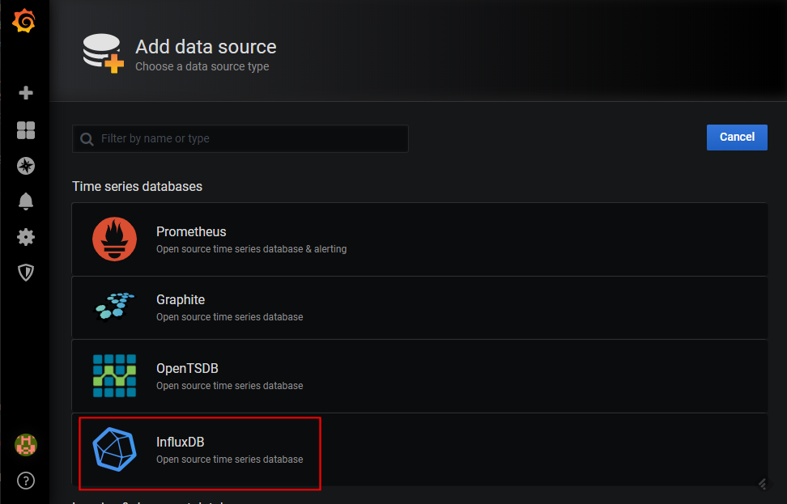

Title: Grafana Configuration
Authors: Nigel Bowden

# Grafana Configuration

Once the Granafa installation is complete, there are two main tasks remaining:

- Integration of Grafana with InfluxDB
- Addition of the wiperf dashboards

## Integration of Grafana with InfluxDB
Integration with InfluxDB is required to allow Grafana to send data queries to the InfluxDB database and turn the data in to graphical reports. To do this, Grafana needs to know:

- the data source is an InfluxDB database
- where it is (IP address & port)
- the name of the database within Influx DB (as we previously configured)
- the access credentials to be used to pull the data out of InfluxDB

The screen-shots below show the required steps:

- Configuration > Data Sources > Added Data Source:

- Select InfluxDB:

- Enter the name to be referenced for the connection, the URL, database name, username & password (all highlighted below) - note the InfluxDB values use those configure previously when we set up InfluxDB (these settings must match those used in the InfluxDB setup):

Once completed, if you hit 'Save and Test', the database connection test should indicate success if all information has been correctly entered.  

## Adding Wiperf Dashboards

