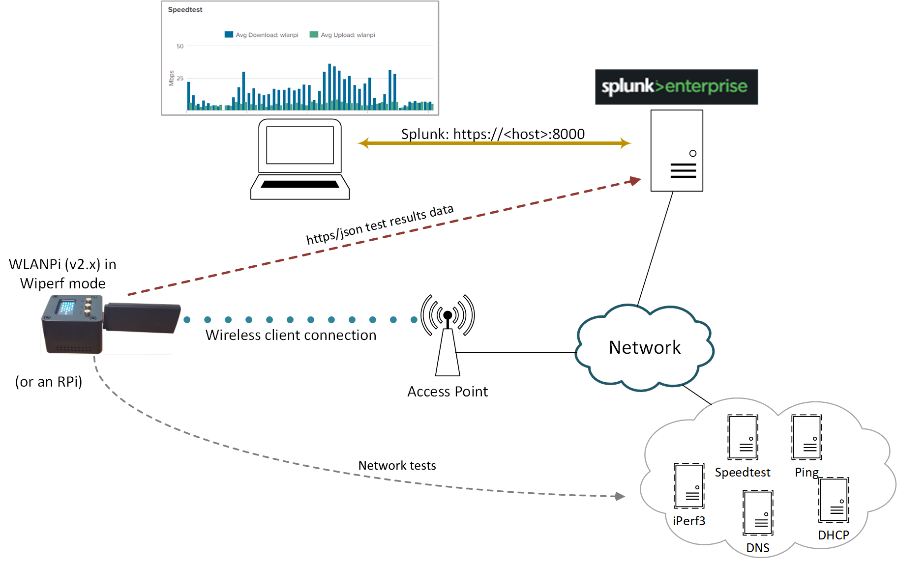

Title: Wiperf documentation operation overview page
Authors: Nigel Bowden

# Overview of Operation
Wiperf is an open source utility that runs on a Raspberry Pi or a WLAN Pi hardware device. It provides network probe functionality to gather performance data to give an indication of how a network looks from an end user perspective. 

It runs a series of tests to gather metrics on network connectivity and performance through the execution of tests such ICMP pings, DNS lookups and iperf. These are fully configurable by editing a local configuration file on the probe device at the time of deployment.

## Configuration
To configure the details of the tests to be run on a probe, a local configuration file on the probe needs to be updated. This will provide information to the probe about items such as the required network connectivity (e.g. wireless/ethernet),  IP and credential information of the data server and test details.

The configuration file can be updated by accessing the CLI of the probe (usually via SSH) and editing the file '/etc/wiperf/config.ini'. 

A default config template file is provided as a start point for the final configuration file ( '/etc/wiperf/config.default/ini'). It is best to take a copy of this file to create the final customised configuration file. When accessing the probe to create the configuration file, a Linux text editor such as 'nano' or 'vi' should be used.

Here is a suggested workflow to create a probe configuration file:

```
 cd /etc/wiperf
 sudo cp ./config.default.ini ./config.ini
 sudo nano ./config.ini
```
### cron (RPI only....not required for WLAN Pi)
In addition to the creating a customised configuration file for the probe, a mechanism is required to run the wiperf utility on a regular basis (e.g. every 5 minutes). Cron is a Linux utility that can be used to run wiperf periodically to gather data over time.

The following CLI commands must be used to add a cron job to the probe to gather data on a regular basis:

```
 sudo crontab -e
```

Add the following line to run the configured tests every 5 minutes:

```
 0-59/5 * * * * /usr/bin/python3 /usr/share/wiperf/wiperf_run.py > /var/log/wiperf_cron.log 2>&1
```

### wpa_supplicant


## Logging
Following the completion of the configuration described above, if all is configured correctly, then wiperf will run every 5 minutes, perform the configured tests, and then send the data back to the data server.

A number of logs are generated to provide support information around the installation and operation of the wiperf process. Each of the generated log files are detailed below:

```
# This log provides details of the installation and upgrade processes, so
# can be useful in diagnosing installation issues

 /var/log/wiperf_install.log
```

```
# This log file is updated by the main wiperf script each time 
# it is run. If the script appears to fail completely, this is 
# a good place to check

 /var/log/wiperg_cron.log
```

```
# This log provides details of the tests performed each time
# that wiperf runs. It is the main file to use for diagnosing
# issues with wiperf 

 /var/log/wiperf_agent.log
``` 

## Reporting





